## 목차
> 1. [프로젝트 소개](#프로젝트-소개)   
> 2. [유스케이스](#유스케이스)   
> 3. [ERD 엔티티 관계도](#ERD-엔티티-관계도)
> 4. [간트차트](#간트차트)   
> 5. [기술 스택](#기술-스택)   
> 6. [주요 기능](#주요-기능)   
> 7. [주요 화면](#주요-화면)
> 8. [API 명세](#API-명세)
> 9. [향후 개선 사항](#향후-개선-사항항)

# 프로젝트 소개
## 다독이다

> 홈페이지명 : 다독이다 (유기견을 사랑하고 보호하는 사람들의 공간)   
> 주제 : 공공데이터를 이용한 유기견 정보 제공 및 애견 커뮤니티 웹사이트
### 목표 
> 1. 공공데이터 API를 이용하여 지역별 보호소 지도 제공 및 전국 유기견의 정보 제공   
> 2. 실종신고와 보호중인 유기견 정보를 커뮤니티로 공유할 수 있는 커뮤니티 게시판   
> 3. 유기견을 입양할 수 있는 입양 시스템 제작   
> 4. 이용자의 사용을 고려한 간단하고 직관적인 웹페이지 제작

> SpringBoot 프레임워크를 사용하여 MVC 패턴의 기본적인 CRUD를 구현하고
> AJAX를 통해 REST API를 설계하여 사용자 중심의 HTTP 비동기 처리를 구현하였습니다.

> **REFERENCE** [포인핸드](https://pawinhand.kr/)   

### 개발 기간
> 2024.09.30 ~ 2024.10.28

### 개발 인원(4명)
> **문성현(팀장)**   
> 기획, 설계, 공공데이터 API, 포트원 API 연동   
> 개발환경 구축, 홈페이지 레이아웃 제작, 테이블 설계, GitHub 코드 리뷰 및 통합관리   
> 메인, 입양하기, 실종신고, 보호중 게시판, 마이페이지 내가 쓴 글, 후원하기 구현   
>   
> **류석현**   
> 기획, 설계, 카카오API 연동   
> 로그인(기본, 카카오), 회원가입, 찜목록, 입양하기, 마이페이지(정보관리, 회원 탈퇴, 입양현황) 구현   
>   
> **이진비**   
> 기획, 설계, 공공데이터 API, 카카오맵 API 연동
> 관리자 페이지(관리자 메인, 전체 글 관리, 회원관리, 입양관리), 보호소 지도 페이지 구현   
>
> **방민규**
> 기획, 설계
> 자유게시판 구현

# 유스케이스
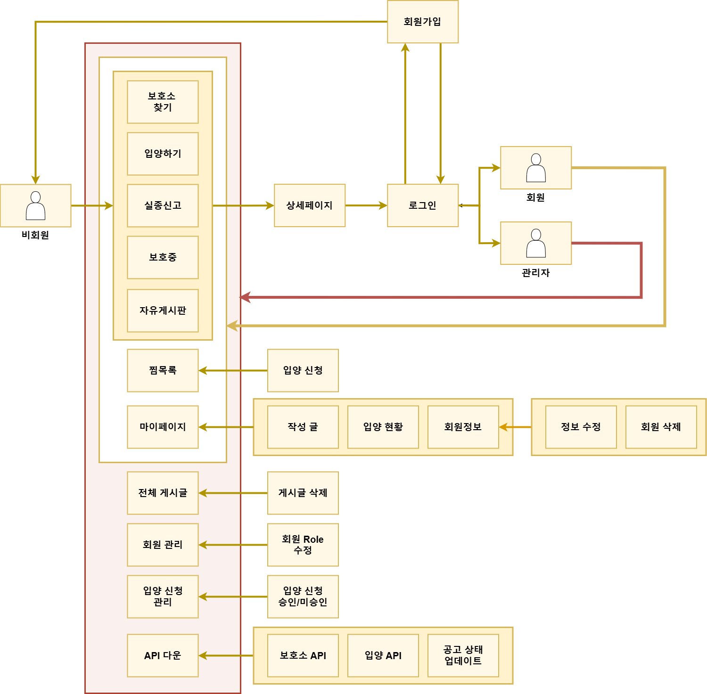 
# ERD 엔티티 관계도
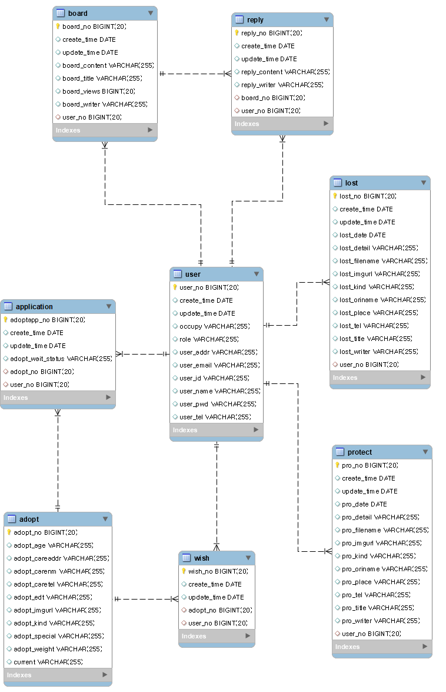 
# 간트차트
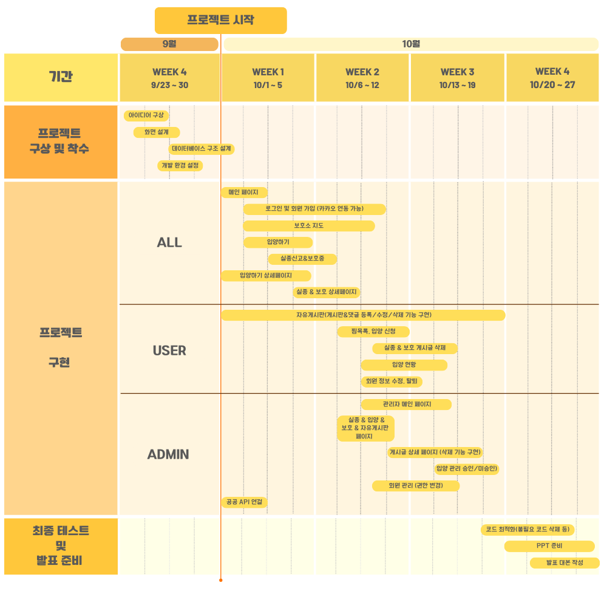 
# 기술 스택
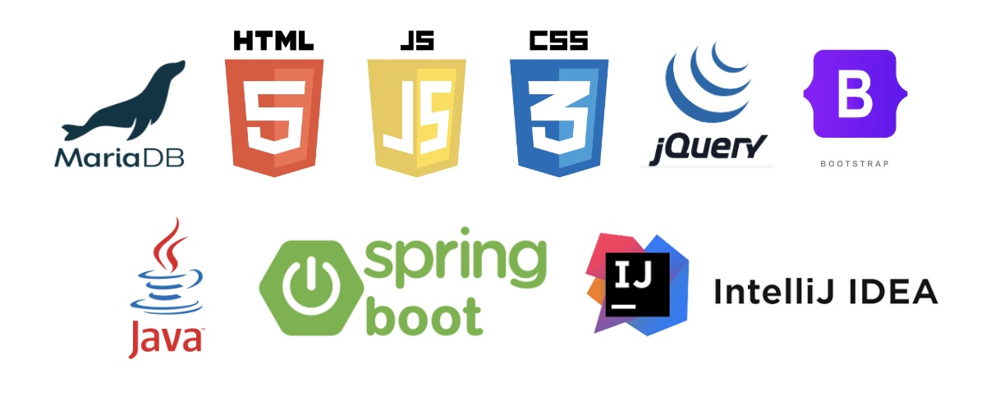 
# 주요 기능
### 요약
|공통|사용자|관리자|
|------|---|---|
|-회원가입, 로그인 -보호소 지도조회 -유기견 정보조회 -전체 게시글 조회 -후원하기|-찜목록 추가 -마이페이지 -입양신청 -게시글, 댓글 작성|-입양 및 지도 API 관리 -회원 관리 -게시글 관리|

## [공통 기능]
### 회원가입, 로그인, 후원하기
* 아이디, 비밀번호 유효성 검증과 비밀번호 암호를 설정했다.
* 카카오 로그인 시 자동 회원가입 및 ID가 주어진다.
* 일반 유저와 카카오 로그인 회원의 권한이 분리되어있다.
* 포트원 API를 통한 후원하기 기능이 제공된다.
### 메인
* 현재 공고마감이 얼마 남지 않은 4개의 입양공고를 조회할 수 있다.
* 가장 최근 실종과 보호중 관련된 게시판의 게시글을 조회할 수 있다.
### 보호소 지도
* 전국 보호소의 위치를 열람할 수 있다.
* 카카오맵을 이용하여 지도상 위치와 길찾기를 조회할 수 있다.
### 입양하기
* 현재 공고 마감되지 않은 유기견의 목록을 조회할 수 있다.
* 상세보기를 통해 유기견의 상세를 조회할 수 있다.
* 오름차순, 내림차순, 견종, 보호소, 주소로 검색이 가능하다.
### 실종신고
* 유저들이 게시한 실종신고 게시글 목록을 조회할 수 있다.
* 실종신고 게시글의 상세를 조회할 수 있다.
* 견종, 제목, 글 내용, 실종 장소로 검색이 가능하다.
### 보호중
* 유저들이 게시한 보호중 게시글 목록을 조회할 수 있다.
* 보호중 게시글의 상세를 조회할 수 있다.
* 견종, 제목, 글 내용, 발견 장소로 검색이 가능하다.
### 자유게시판
* 게시글과 댓글을 조회할 수 있다.
* 제목, 내용, 작성자로 검색이 가능하다.

## [사용자 기능]
### 게시판 공통 기능
* 실종신고, 보호중, 자유게시판에 글 작성, 댓글 작성이 가능하다.
* 자신이 작성한 게시글및 댓글에 대해 수정 및 삭제가 가능하다.
### 찜목록, 입양 기능
* 입양하기 상세보기에서 유기견을 찜목록에 추가할 수 있다.
* 마이페이지에서 찜목록 조회를 통해 내역을 확인하고 입양신청을 할 수 있다.
* 현재 입양 현황을 대기, 승인, 거절 세가지의 형태로 확인이 가능하다.
### 개인 정보 관리
* 회원의 개인 정보 (비밀번호, 주소, 이메일) 변경이 가능하다.
* 회원 탈퇴를 통하여 회원을 unlock 상태로 만들지만 로그인이 불가능하다(데이터 유지)

## [관리자 기능]
### API 관리
* 1일 단위로 현재 입양하기 공고가 끝난 게시글들을 보이지 않게 적용하고 새로 추가된 공고를 보이게 한다.
* 모든 입양하기 게시글의 삭제가 가능하다.
* 보호소의 업데이트된 내역 변경이 가능하다.
### 회원 관리
* 모든 회원의 정보를 조회할 수 있으며, 권한 변경이 가능하다.
### 전체 게시판 관리
* 모든 게시글을 조회할 수 있으며, 삭제가 가능하다.

# 주요 화면
|메인|회원가입|
|------|---|
||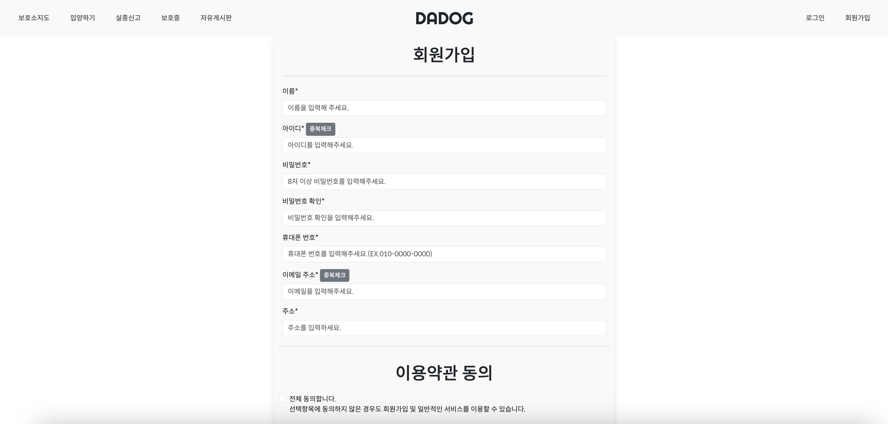|
|보호소 지도|입양하기|
|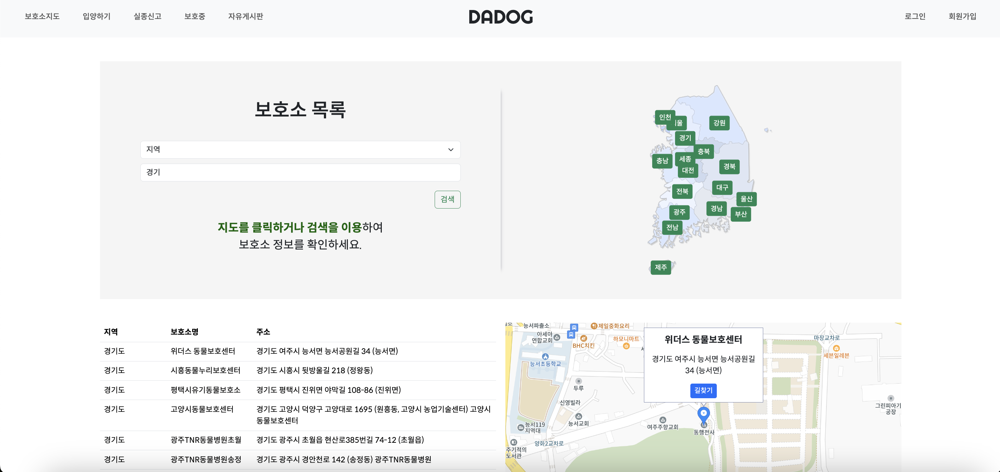|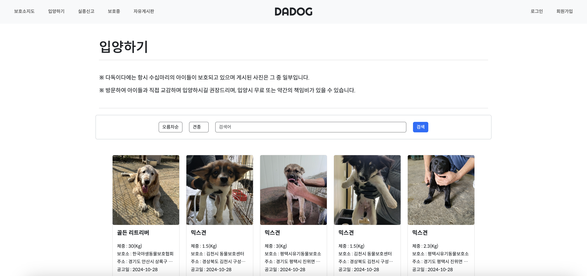|
|실종신고|보호중|
|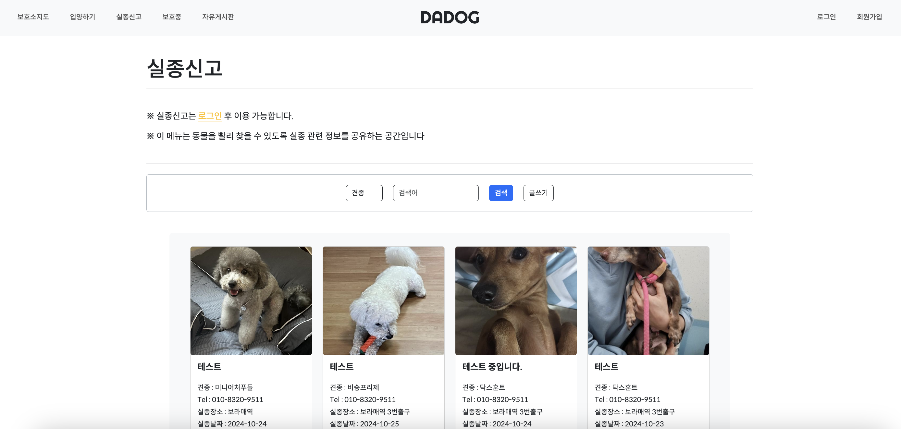||
|자유게시판|마이페이지|
|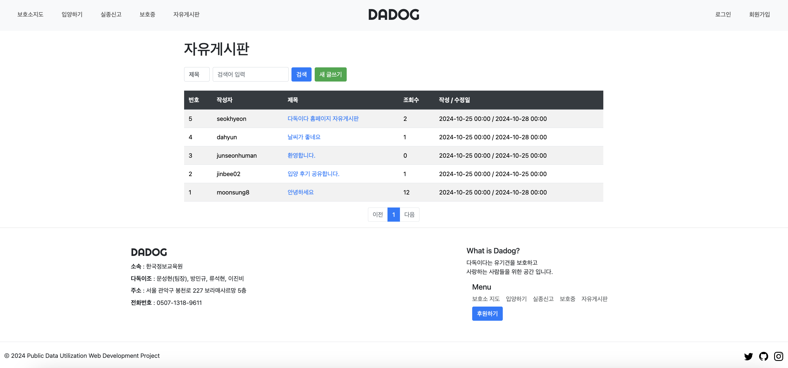|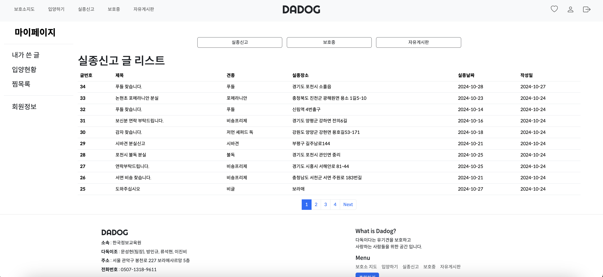|
|관리자 페이지|
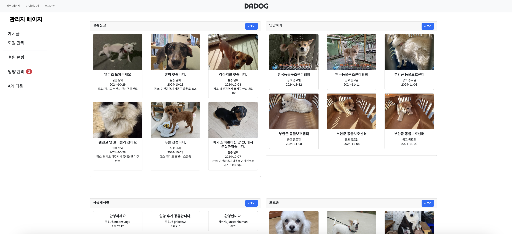|

# API 명세
|Domain|URL|Method|Description|Role|
|------|---|---|---|---|
|Adopt|/dadog/admin/adopt/api|GET|Adoption 데이터를 외부 API에서 가져와 저장.|Admin|
||/dadog/admin/adopt/updateApi|GET|기존 Adoption 데이터를 최신화.|Admin|
||/dadog/admin/main|GET|대시보드에 필요한 요약 정보 제공.|Admin|
||/dadog/admin/adopt/list/{page}|GET|페이지네이션을 통한 입양 목록 보기.|Admin|
|/dadog/adopt/list/{page}|GET|입양 목록 조회, 페이지네이션 지원	AdoptSearchDTO를 기반으로 입양 목록 조회.|User|
||/dadog/adopt/list|GET|입양 목록 조회, 첫 페이지 기본값	AdoptSearchDTO를 기반으로 입양 목록 조회.|User|
||/dadog/adopt/{adoptNo}|GET|특정 입양 정보 상세 조회	adoptNo 기반 입양 상세 정보 제공.|User|
||/dadog/adopt/addWish|POST|찜 목록 추가	WishDTO와 사용자 정보 기반 찜 항목 추가.|User|
|Board List|/dadog/boards|GET|선택적 검색 및 페이징을 통한 게시물 목록을 조회.|Public|
||/dadog/boards/new|GET|새 게시물 작성을 위한 페이지를 반환.|User|
||/dadog/boards/new|POST|새 게시물을 추가.|User|
||/dadog/boards/get/{boardNo}|GET|특정 게시물의 상세 정보를 조회.|Public|
||/dadog/boards/update/{boardNo}|GET|게시물 수정을 위한 페이지를 반환.|User|
||/dadog/boards/update/{boardNo}|POST|특정 게시물을 업데이트.|User|
||/dadog/boards/delete/{boardNo}|POST|특정 게시물을 삭제.|User| 
||/kakao/callback|GET|카카오로부터 인증 코드를 받아 사용자 정보를 요청하고 세션에 저장.|Public|
|Lost Items|/dadog/lost/list|GET|검색 기준에 따라 분실물의 페이지별 목록을 표시.|Users|
||/dadog/lost/add|GET|새로운 분실물을 추가하기 위한 양식을 표시.|Users|
||/dadog/lost/add|POST|새로운 분실물 등록 요청을 처리하며, 입력 검증 및 이미지 업로드를 수행.|Users|
||/dadog/lost/get/{lostNo}|GET|특정 ID에 따라 분실물의 세부 정보를 조회하고 표시.|Users|
||/dadog/lost/update/{lostNo}|GET|기존 분실물 수정을 위한 양식을 표시하며, 사용자 권한을 검증.|Users|
||/dadog/lost/{lostNo}|POST|기존 분실물 수정을 위한 요청을 처리하며, 선택적으로 이미지 업로드를 처리.|Users|
||/dadog/lost/{lostNo}|DELETE|특정 ID에 따라 분실물을 삭제하며, 사용자 권한을 검증.|Users|
|Main Page|/dadog/main|GET|메인 페이지를 로드하며, 최근 입양, 분실물, 보호소 정보를 가져와 모델에 추가.|User|
||/dadog/sign|GET|사용자 로그인 페이지를 표시.|User|
||/dadog/spon|POST|후원 요청을 처리하고, 성공적으로 추가되면 후원 정보를 반환.|User|
||/dadog/forbidden|GET|접근 권한이 없는 사용자에게 보여줄 페이지를 반환.|User|
|User Registration|/dadog/members/new|GET|회원가입 폼 페이지를 표시.|User|
||/dadog/members/new|POST|회원가입 처리를 수행.|User|
||/dadog/members/login|GET|로그인 페이지를 표시.|User|
||/dadog/members/check-id|GET|아이디 중복 체크를 수행.|User|
||/dadog/members/check-email|GET|이메일 중복 체크를 수행.|User|
||/dadog/members/logout|POST|로그아웃을 처리.|User|
||/dadog/members/login/error|GET|로그인 오류를 처리.|User|
||/dadog/members/UseAgree|GET|이용약관 동의 페이지를 표시.|User|
||/dadog/members/Agreement|GET|개인정보 처리방침 페이지를 표시.|User|
|User Management|/dadog/myPage|GET|사용자의 마이 페이지를 표시하며, 사용자 정보와 게시물을 보여줌.|User|
||/dadog/myPage/myWriting|GET|사용자가 작성한 게시물 목록을 표시.|User|
||/dadog/myPage/myMemberForm|GET|수정할 사용자의 정보를 가져와서 표시.|User|
||/dadog/myPage/myMemberForm|POST|사용자의 정보(이름, 주소, 전화, 이메일)를 업데이트.|User|
||/dadog/myPage/{no}/edit|GET|특정 사용자의 수정 양식을 표시.|Admin|
||/dadog/myPage/update|POST|제공된 DTO를 기반으로 사용자의 정보를 업데이트.|Admin|
||/dadog/myPage/myAdopt|GET|사용자의 입양 상태 및 신청 목록을 표시.|User|
||/dadog/myPage/myAdopt/{appNo}|GET|특정 입양 신청에 대한 자세한 정보를 가져옴.|User|
||/dadog/myPage/myLost|POST|사용자의 잃어버린 애완동물 신고를 가져옴.|User|
||/dadog/myPage/myProtect|POST|사용자의 보호 애완동물 신고를 가져옴.|User|
||/dadog/myPage/myBoard|POST|사용자의 게시판 게시물을 가져옴.|User|
||/dadog/myPage/myPwd|GET|사용자를 위한 비밀번호 변경 양식을 표시.|User|
||/dadog/myPage/myPwd|POST|비밀번호를 검증하여 사용자의 비밀번호를 업데이트.|User|
||/dadog/myPage/delete|GET|사용자의 계정을 삭제하고 로그아웃.|User|
|Animal Protection List|/dadog/protect/list|GET|검색 기능을 포함한 보호 동물 목록을 표시.|User|
||/dadog/protect/list/{page}|GET|특정 페이지의 보호 동물 목록을 표시.|User|
||/dadog/protect/add|GET|보호 동물을 등록하기 위한 폼을 표시.|User|
||/dadog/protect/add|POST|보호 동물을 등록하고 이미지 파일을 업로드.|User|
||/dadog/protect/get/{proNo}|GET|특정 보호 동물의 상세 정보를 표시.|User|
||/dadog/protect/update/{proNo}|GET|특정 보호 동물을 수정하기 위한 폼을 표시.|User|
||/dadog/protect/{proNo}|POST|보호 동물의 정보를 수정하고 이미지 파일을 업로드.	|User|
||/dadog/protect/{proNo}|DELETE|특정 보호 동물을 삭제.|User|
|Get Replies|/dadog/boards/reply/{boardNo}|GET|특정 게시판에 대한 댓글 목록을 조회하고 해당 게시판으로 리디렉션.|User|
||/dadog/boards/reply/{boardNo}/add|POST|특정 게시판에 댓글을 추가. 로그인 필요.|User|
||/dadog/boards/reply/{boardNo}/update/{replyNo}|POST|특정 댓글을 수정. 로그인 필요.|User|
||/dadog/boards/reply/{boardNo}/delete/{replyNo}|POST|특정 댓글을 삭제. 로그인 필요.	|User|
|Save Shelter Data|/dadog/shelter/api|GET|외부 API에서 보호소 데이터를 가져와 저장.|Admin|
||/dadog/shelter|GET|보호소 목록을 조회하고 페이지네이션 및 필터링 기능을 제공.|User|
|Kakao Login|/api/user/kakao/login|POST|카카오 로그인을 처리하고 사용자의 정보를 세션에 저장.|User|
||/api/user/login|POST|사용자 자격 증명을 검증하고 성공 시 메인 페이지로 리다이렉트. 유효하지 않은 경우 로그인 페이지로 에러 메시지와 함께 리다이렉트.|User|
|View Wish List|/dadog/wishList|GET|사용자의 찜 목록을 표시. 사용자가 로그인하지 않은 경우 로그인 페이지로 리다이렉트.|User|
||/dadog/wish/{wishNo}|DELETE|사용자의 찜 목록에서 항목을 삭제. 사용자가 권한이 없으면 403 Forbidden을 반환.|User|
||/dadog/adopt/{adoptNo}|POST|특정 항목에 대한 입양 신청을 처리. 사용자가 로그인하지 않은 경우 401 Unauthorized를 반환.|User|

# 향후 개선 사항
> * 사용자 맞춤형 추천 시스템
- 사용자의 선호도와 입양 기록을 기반으로 개별 맞춤형 개체 추천 기능을 개발하여 사용자에게 적합한 입양 개체를 제안.
> * 모바일 앱 개발
- 웹 플랫폼뿐만 아니라 모바일 앱을 통해 더 많은 사용자에게 접근성을 높이고, 실시간 알림 및 편리한 UI를 제공하여 사용자의 참여를 유도.
> * 입양 후 관리 시스템
- 입양 후 개체의 상태를 추적하고, 사용자에게 정기적으로 업데이트를 제공하여 입양 후의 책임감을 높임. 또한, 관련된 팁이나 자원을 제공하는 기능도 포함할 수 있음.
> * 입양 커뮤니티 구축
- 입양한 사용자들이 소통하고 경험을 공유할 수 있는 커뮤니티 기능을 개발하여, 사용자 간의 연결을 강화.
> * AI 기반의 상담 시스템
- 사용자가 입양 관련 질문이나 고민을 상담할 수 있는 AI 기반의 챗봇 시스템을 도입하여, 24시간 지원을 제공.
> * 통계 및 분석 기능 강화
- 입양 데이터 및 사용자 활동을 분석하여, 입양 트렌드 및 사용자 요구를 파악하고 이를 기반으로 서비스 개선 방향을 설정.
> * 보호소 연계 강화
- 보호소와의 협력을 강화하여, 입양 가능한 동물의 정보와 건강 상태를 실시간으로 업데이트하고, 보호소의 연락처 및 위치 정보를 사용자에게 제공하여 접근성을 높임.
