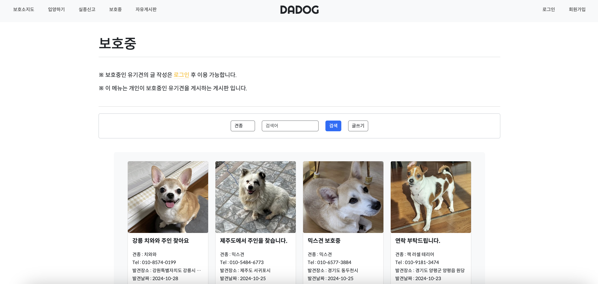

## 목차
> 1. [프로젝트 소개](#프로젝트-소개)   
> 2. [유스케이스](#유스케이스)   
> 3. [ERD 엔티티 관계도](#ERD-엔티티-관계도)
> 4. [간트차트](#간트차트)   
> 5. [기술 스택](#기술-스택)   
> 6. [주요 기능](#주요-기능)   
> 7. [주요 화면](#주요-화면)
> 8. [API 명세](#API-명세)
> 9. [향후 개선 사항](#향후-개선-사항항)

# 프로젝트 소개
## 다독이다

> 홈페이지명 : 다독이다 (유기견을 사랑하고 보호하는 사람들의 공간)   
> 주제 : 공공데이터를 이용한 유기견 정보 제공 및 애견 커뮤니티 웹사이트
### 목표 
> 1. 공공데이터 API를 이용하여 지역별 보호소 지도 제공 및 전국 유기견의 정보 제공   
> 2. 실종신고와 보호중인 유기견 정보를 커뮤니티로 공유할 수 있는 커뮤니티 게시판   
> 3. 유기견을 입양할 수 있는 입양 시스템 제작   
> 4. 이용자의 사용을 고려한 간단하고 직관적인 웹페이지 제작

> SpringBoot 프레임워크를 사용하여 MVC 패턴의 기본적인 CRUD를 구현하고
> AJAX를 통해 REST API를 설계하여 사용자 중심의 HTTP 비동기 처리를 구현하였습니다.

> **REFERENCE** [포인핸드](https://pawinhand.kr/)   

### 개발 기간
> 2024.09.30 ~ 2024.10.28

### 개발 인원(4명)
> **문성현(팀장)**   
> 기획, 설계, 공공데이터 API, 포트원 API 연동   
> 개발환경 구축, 홈페이지 레이아웃 제작, 테이블 설계, GitHub 코드 리뷰 및 통합관리   
> 메인, 입양하기, 실종신고, 보호중 게시판, 마이페이지 내가 쓴 글, 후원하기 구현   
>   
> **류석현**   
> 기획, 설계, 카카오API 연동   
> 로그인(기본, 카카오), 회원가입, 찜목록, 입양하기, 마이페이지(정보관리, 회원 탈퇴, 입양현황) 구현   
>   
> **이진비**   
> 기획, 설계, 공공데이터 API, 카카오맵 API 연동
> 관리자 페이지(관리자 메인, 전체 글 관리, 회원관리, 입양관리), 보호소 지도 페이지 구현   
>
> **방민규**
> 기획, 설계
> 자유게시판 구현

# 유스케이스
 
# ERD 엔티티 관계도
 
# 간트차트
 
# 기술 스택
 
# 주요 기능
### 요약
|공통|사용자|관리자|
|------|---|---|
|-회원가입, 로그인 -보호소 지도조회 -유기견 정보조회 -전체 게시글 조회 -후원하기|-찜목록 추가 -마이페이지 -입양신청 -게시글, 댓글 작성|-입양 및 지도 API 관리 -회원 관리 -게시글 관리|

## [공통 기능]
### 회원가입, 로그인, 후원하기
* 아이디, 비밀번호 유효성 검증과 비밀번호 암호를 설정했다.
* 카카오 로그인 시 자동 회원가입 및 ID가 주어진다.
* 일반 유저와 카카오 로그인 회원의 권한이 분리되어있다.
* 포트원 API를 통한 후원하기 기능이 제공된다.
### 메인
* 현재 공고마감이 얼마 남지 않은 4개의 입양공고를 조회할 수 있다.
* 가장 최근 실종과 보호중 관련된 게시판의 게시글을 조회할 수 있다.
### 보호소 지도
* 전국 보호소의 위치를 열람할 수 있다.
* 카카오맵을 이용하여 지도상 위치와 길찾기를 조회할 수 있다.
### 입양하기
* 현재 공고 마감되지 않은 유기견의 목록을 조회할 수 있다.
* 상세보기를 통해 유기견의 상세를 조회할 수 있다.
* 오름차순, 내림차순, 견종, 보호소, 주소로 검색이 가능하다.
### 실종신고
* 유저들이 게시한 실종신고 게시글 목록을 조회할 수 있다.
* 실종신고 게시글의 상세를 조회할 수 있다.
* 견종, 제목, 글 내용, 실종 장소로 검색이 가능하다.
### 보호중
* 유저들이 게시한 보호중 게시글 목록을 조회할 수 있다.
* 보호중 게시글의 상세를 조회할 수 있다.
* 견종, 제목, 글 내용, 발견 장소로 검색이 가능하다.
### 자유게시판
* 게시글과 댓글을 조회할 수 있다.
* 제목, 내용, 작성자로 검색이 가능하다.

## [사용자 기능]
### 게시판 공통 기능
* 실종신고, 보호중, 자유게시판에 글 작성, 댓글 작성이 가능하다.
* 자신이 작성한 게시글및 댓글에 대해 수정 및 삭제가 가능하다.
### 찜목록, 입양 기능
* 입양하기 상세보기에서 유기견을 찜목록에 추가할 수 있다.
* 마이페이지에서 찜목록 조회를 통해 내역을 확인하고 입양신청을 할 수 있다.
* 현재 입양 현황을 대기, 승인, 거절 세가지의 형태로 확인이 가능하다.
### 개인 정보 관리
* 회원의 개인 정보 (비밀번호, 주소, 이메일) 변경이 가능하다.
* 회원 탈퇴를 통하여 회원을 unlock 상태로 만들지만 로그인이 불가능하다(데이터 유지)

## [관리자 기능]
### API 관리
* 1일 단위로 현재 입양하기 공고가 끝난 게시글들을 보이지 않게 적용하고 새로 추가된 공고를 보이게 한다.
* 모든 입양하기 게시글의 삭제가 가능하다.
* 보호소의 업데이트된 내역 변경이 가능하다.
### 회원 관리
* 모든 회원의 정보를 조회할 수 있으며, 권한 변경이 가능하다.
### 전체 게시판 관리
* 모든 게시글을 조회할 수 있으며, 삭제가 가능하다.

# 주요 화면
|메인|회원가입|
|------|---|
|||
|보호소 지도|입양하기|
|||
|실종신고|보호중|
|||
|자유게시판|마이페이지|
|||
|관리자 페이지|
|

